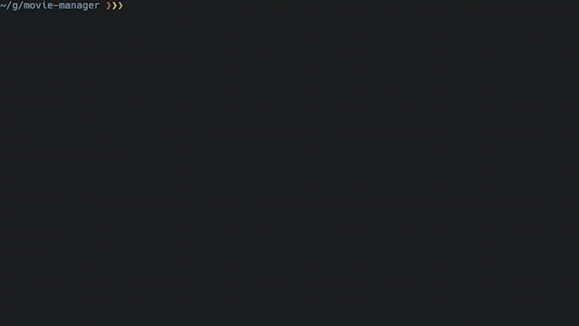
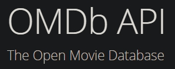

# movie manager


## What is this?

Have an unorganized movie library? Have inconsistent file naming? Don't have time to rename them all manually? Plex doesn't recognize your movies correctly? Then this is for you!

<i>mm</i> will help you to rename your movie library.



## Great! What do I need?

Just regular python3 with `PyInquirer`.
Just run `pip3 install PyInquirer` and fire up the tool.

```
python3 mm.py -i moviefolder/
```

## What are the features?

<i>mm</i> features the following:

*  Easy file renaming with cli
*  Get infos from [The Movie DB](https://www.themoviedb.org/) and IMDb/[OMDb](https://www.omdbapi.com/)
*  Language support (as far as the database supports it)
*  Search based on existing filename. Or just use a custom search string

## How to use

You can use multiple files or folders:

```
python3 mm.py -i movie.mkv moviefolder/ someothershit/
```

I speak spanish/german/french/... What can i do? Use your [language code](http://www.lingoes.net/en/translator/langcode.htm):

```
python3 mm.py -i movie.mkv -l de-DE
```
Only want to use a specific database? For now you can choose between tmdb and omdb:

```
python3 mm.py movie.mkv -db tmdb
```

Everything:

```
$ python3 mm.py -h

usage: mm.py [-h] -i [INPUT [INPUT ...]] [-db DATABASE] [-l LANGUAGE]

optional arguments:
  -h, --help            show this help message and exit
  -i [INPUT [INPUT ...]], --input [INPUT [INPUT ...]]
                        Input file or directory
  -db DATABASE, --database DATABASE
                        "tmdb" and "omdb" so far. Leave blank for all.
  -l LANGUAGE, --language LANGUAGE
                        Searche databases in this language. Default is en-US. OMDB doesn't support language support.
```

## Terms of use

API keys to databases are included in the script. Please use them fair or I have to disable them. If they don't work or limit is reached, please create your own.

## Contribution

I would highly appreciate any kind of support. May it be adding new databases or cleaning up the code. Just create pull requests.

## Credits

<table>
<tr>
<td>
<a href="https://www.themoviedb.org/">

</a>
</td>
<td>
<a href="https://www.omdbapi.com/">

</a>
</td>
</tr>
</table>